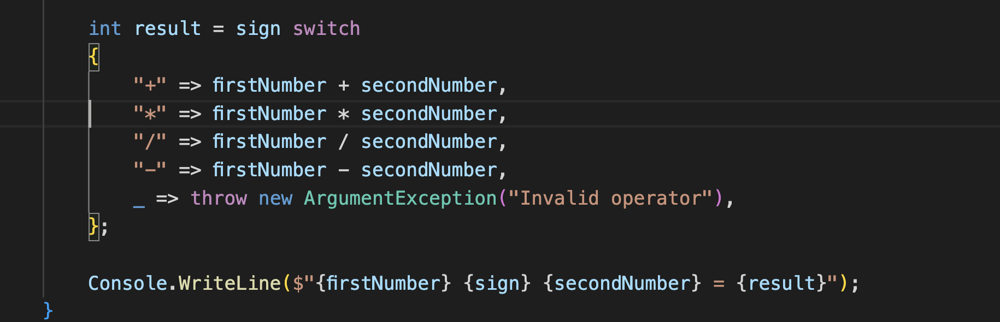

# Calculator

You can calculate any number in this Console Application and this very userfriendly.

Have a look at `Program.cs` and use can see and use this code for free.

1) Console Input/Output 

2) Checking Sign

3) Convert 

3) Pattern Matching 

4) Demo 

